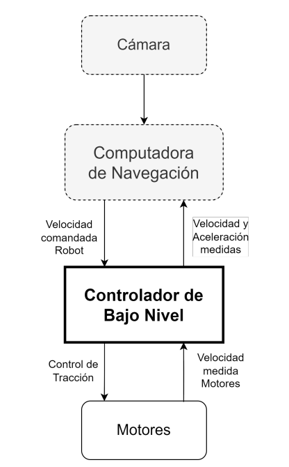

# PF_RobotOmnidireccional
## Proyecto Final de Grado - Ingeniería Electrónica
## _"Sistema de Control de Tracción de Bajo Nivel para un Robot Móvil"_

  

### Introducción
El proyecto se centra en el desarrollo de un sistema de control de tracción de
bajo nivel para un robot móvil. Su principal objetivo es transformar los comandos de velocidad provenientes de la Computadora de Navegación en velocidades
individuales para cada motor. Además, el sistema ejecuta un lazo de control de
velocidad en cada rueda, midiendo y ajustando la tensión media aplicada a cada
motor. Finalmente, el sistema envía datos de velocidad estimada y aceleración a
la Computadora de Navegación.
Este proyecto forma parte de una iniciativa más amplia del Centro Universitario
de Automatización y Robótica (CUDAR) de la UTN FRC, que abarca el diseño,
desarrollo y construcción de un sistema de odometría multi-cámara montado en
un robot móvil, destinado a encontrar trayectorias eficientes en ambientes desconocidos y dinámicos.

### Contexto
A continuación se presenta el diagrama de contexto del sistema, que muestra
las entidades externas con las que éste interactúa y la naturaleza de dichas interacciones.

  

Puede observarse que el sistema interactúa directamente con las siguientes entidades externas:
La Computadora de navegación (CDN), que provee la velocidad comandada y recibe la velocidad estimada y la aceleración medida por el Controlador de Bajo Nivel (CBN).
La gravedad y la aceleración, que son medidas para el uso de la Computadora de Navegación.
Los Motores del robot móvil, cuya velocidad es seteada y medida por el sistema.

### Arquitectura de Software

En la siguiente figura se muestra el diagrama conceptual de este proyecto, en el cual se pueden apreciar dos caminos principales.

  

En primer lugar, la velocidad comandada es enviada por la CDN y recibida por el CBN, la cual es convertida en comandos de velocidad para cada motor y finalmente se envía una señal para controlar los motores, teniendo en cuenta el valor de la velocidad medida de estos últimos. En otra instancia, se miden tanto los valores de velocidad de cada motor, como los valores de aceleraciones del robot, los cuales son enviados finalmente al CDN.

_Para una explicación más detallada referirse al informe completo en la carpeta "Informe"_